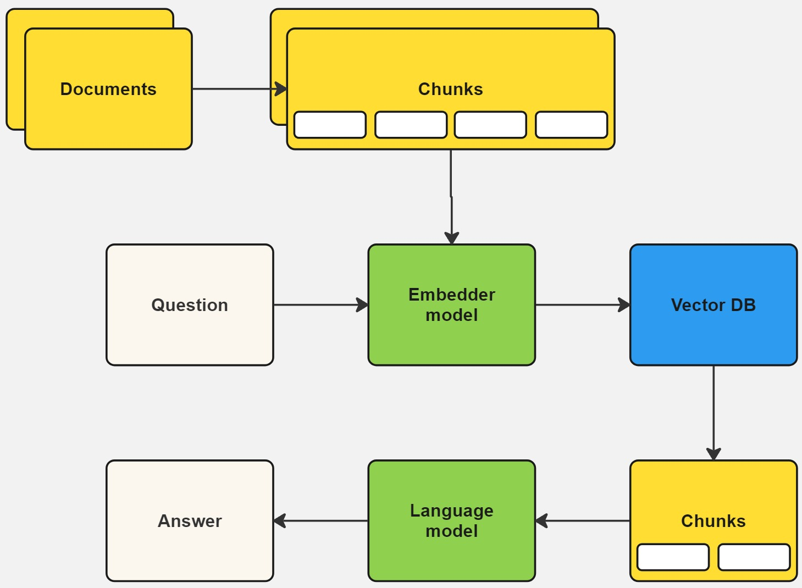

# AraRAG
This project is a chatbot application that can process Arabic PDF files. It uses the RAG model for generating responses in Arabic and Gradio for the user interface. The chatbot can also evaluate its own performance using the Cohere API.

## Getting Started
These instructions will get you a copy of the project up and running on your local machine for development and testing purposes.

### Prerequisites
The project requires the following Python packages:
- gradio
- PyMuPDF
- cohere

You can install these packages using pip:
```bash
pip install -r requirements.txt
```
### Environment Variables
The project uses environment variables to manage sensitive information. Make sure to set these variables in your environment or in a .env file:
- `SPELLBOOK_BASE_URL`: The base URL for the Spellbook API.
- `SPELLBOOK_API_KEY`: Your Spellbook API key.
- `VECTOR_STORE_NAME`: The name of the vector store to be created.
- `OPENAI_API_KEY`: Your OpenAI API key for the RAG model.
- `COHERE_API_KEY`: Your Cohere API key for evaluating the chatbot's performance.

## Creating a Vector Store
Before running the chatbot, you need to create a vector store using the `create_vector_store.py` script. This script uses the Spellbook API to create a vector store with the name specified in the `VECTOR_STORE_NAME` environment variable.

## Running the Chatbot
You can run the chatbot using the `app.py` script. This script uses Gradio to create a chatbot interface. The chatbot can accept text input or a PDF file. If a PDF file is uploaded, the script will extract the text from the PDF and use it as input to the RAG model.

## Evaluating the Chatbot
You can evaluate the chatbot's performance using the evaluate.py script. This script uses the Cohere API to evaluate the correctness of the chatbot's answers. The script reads a CSV file with a set of questions and their correct answers, uses the chatbot to answer the questions, and then evaluates the correctness of the chatbot's answers.

## Data Flow



The data flow in the application is as follows:

1. The user uploads a PDF file in the Gradio interface.
2. The content of the PDF file is processed by the RAG class.
3. The processed text is split into chunks and embeddings are generated for each chunk.
4. The embeddings are ingested into the Spellbook service.
5. When the user sends a message, embeddings are generated for the message and similar documents are retrieved from the Spellbook service.
6. The retrieved documents are reranked using [Cohere's reranking model](https://docs.cohere.com/docs/reranking).
7. The retrieved and reranked documents and the user's message are used to generate a response using the Cohere API.
8. The generated response is displayed to the user in the Gradio interface.